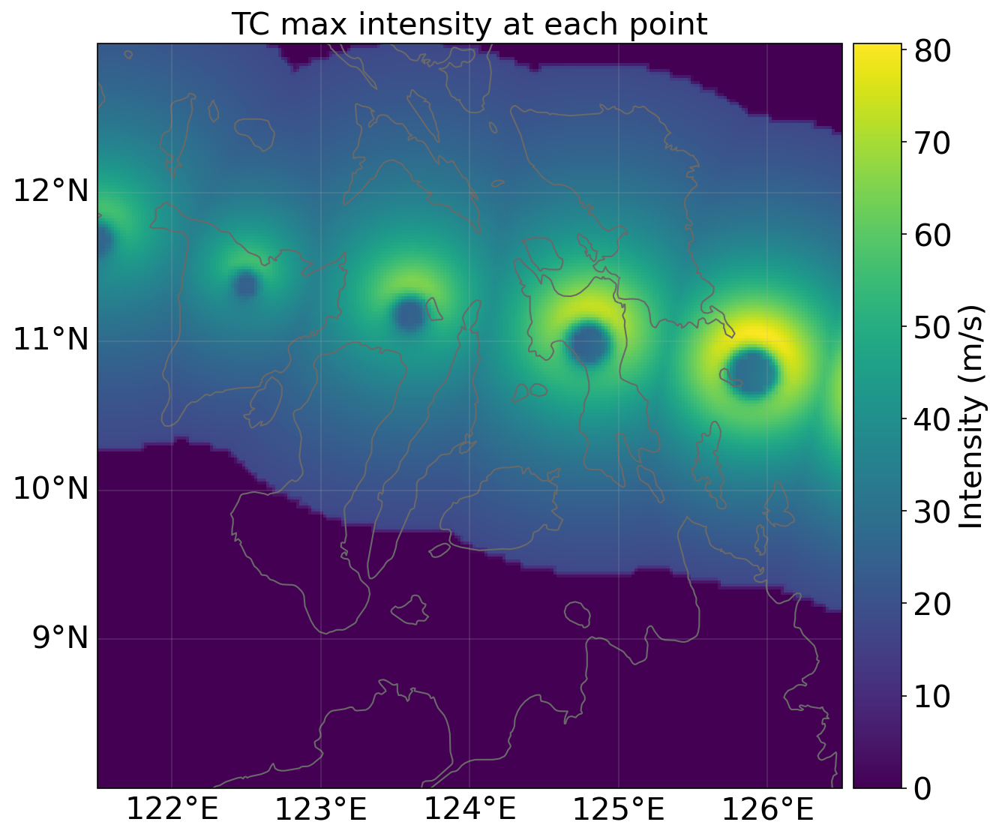
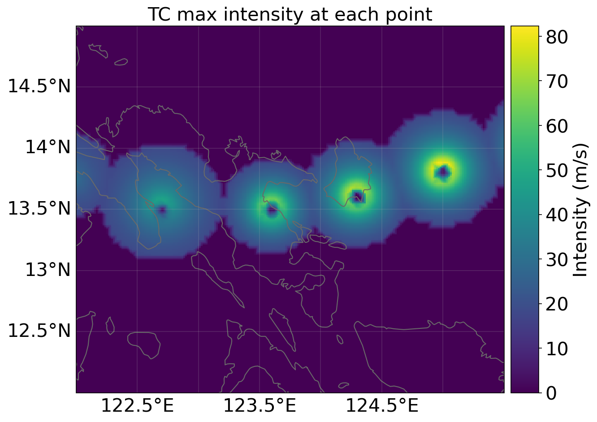
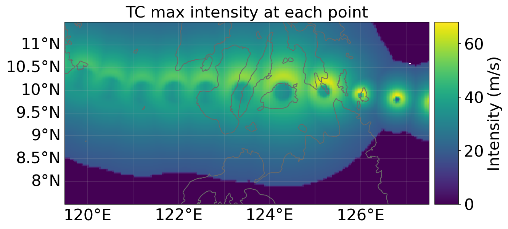

> ⚠️ **Landfall is a research and preparedness demonstration. It is NOT an operational
> forecasting tool and must not be used for emergency decision-making.** Damage estimates
> from tropical cyclone models of this class are routinely off by 2–5×; documenting that
> error honestly is the point of this project.

# Landfall

[](https://github.com/agilap/landfall)

**Counterfactual typhoon damage simulation for the Philippines.**

A deterministic hazard–exposure–vulnerability engine (CLIMADA) computes all damage
figures for three historical Philippine typhoons — Haiyan (2013), Rolly (2020), and
Odette (2021) — and for counterfactual scenarios (track offset, bearing, intensity delta).
An LLM layer narrates cached engine output as a plain-language briefing; **every numeric
claim in generated briefings is mechanically verified against the impact engine's cached
output before it reaches the user, with ungrounded claims regenerated or redacted.** A
local retrieval layer answers "what actually happened" questions against NDRRMC situation
reports, with citations.

Physics computes. The LLM narrates. No load-bearing number originates in a language model.

## Hazard maps

Holland (1980) max-sustained-wind fields, synthesized from IBTrACS best-track data over
each storm's regional exposure corridor:

| Haiyan (2013) | Rolly (2020) | Odette (2021) |
|---|---|---|
|  |  |  |

## Status

Phases 1–8 of the PRD (`landfall-prd.md`) are done. What's built and what isn't, honestly:

**Built:** IBTrACS track ingestion for all three storms; Holland (1980) wind fields;
LitPop exposure nationally, with a hybrid OSM-buildings + PSA-census layer for
Catanduanes/Albay/Camarines Sur (v1.1 Phase 3 — see E1 below); WP2-calibrated impact
functions (Eberenz et al. 2021, EDR calibration with an interquartile uncertainty range
as of v1.2 Phase 1 — see below); per-municipality
damage and affected-population breakdown (GADM administrative boundaries, spatially
joined against impact-engine output — Odette's top municipality is Cebu City, Haiyan's is
Tacloban City, both matching real-world reporting); a validated, hard-range-checked
counterfactual scenario schema (track offset/bearing, intensity delta) with a
scenario-hash disk cache; an LLM narrator with a groundedness verifier that regenerates or
redacts any numeric claim it can't trace to cached impact output; a local RAG interrogator
(bge-m3 embeddings, no API calls) over NDRRMC sitreps with source citations, using
table-aware extraction (`pdfplumber`) so a retrieved number stays attached to its own
table row instead of a neighboring one, plus LLM-assisted query rewriting to compensate
for retrieval missing a passage that a terser keyword query finds; an answer-synthesis
layer on top of that retrieval, with its own groundedness check — **and a real
limitation that check surfaced and Phase 8 partially fixed**, see below.

Also built: the **NL → scenario-config compiler** (`src/landfall/llm/compiler.py`) and
its E3 eval — with a disclosed caveat. PRD §6 says E3's ground-truth configs are
hand-labeled by the author and not delegable; at the author's explicit direction, the
eval set (now 82 cases, after adding range-phrased, storm-name, and refusal-phrasing
test cases) was instead authored by
the same coding agent that built the compiler.
That is a circularity risk (an agent writing both sides of its own exam), so it is
stated here rather than hidden, and the eval set is plain JSON
(`evals/e3_dataset.json`) open to author audit.

**Not built / deferred:**
- **Tagalog narration** — English only so far; same verifier applies once added.
- **Attribution as a proven property in general** — Phase 8's table-aware extraction
  fixes the specific documented misattribution (a province-level subtotal read as
  belonging to one municipality), but doesn't guarantee every retrieved row is about the
  entity a question asks about; an eval for retrieval/attribution quality analogous to
  E2/E3 isn't built, for the same reason E3 flagged — it needs human-checked ground truth,
  not agent-generated ground truth. See `docs/phase8-result.md`.
- **Stack deviation:** PRD §5.2 specifies an Anthropic Haiku-class model for the narrator;
  no Anthropic key was available in the build environment, so the narrator uses OpenAI's
  `gpt-4o-mini` instead, per the author's direction. Functionally equivalent for this
  project's purposes.

See `docs/phase1-plan.md` through `docs/phase8-result.md` (v1), `docs/v1.1-phase1-result.md`
through `docs/v1.1-phase5-result.md` (v1.1's underestimation fix), and
`docs/v1.2-phase1-result.md` through `docs/v1.2-phase2-result.md` (v1.2's
calibration-uncertainty fix) for the session-by-session build log, including three
real bugs caught before they reached a shipped number (a wrong IBTrACS storm ID, a
stale post-redaction groundedness report, and a wasted GPU-torch install), each
described alongside how it was caught.

## Usage

```
pip install -e .
landfall run haiyan                                   # historical replay
landfall run rolly --offset-km 100 --bearing 0         # counterfactual: 100 km north
landfall narrate odette --intensity-delta 20           # + verified narration
landfall compile "Shift Rolly 50 km south"              # NL -> ScenarioConfig
landfall ask "What happened in Catanduanes?" --storm rolly   # sitrep RAG interrogator
```

Damage is a point estimate plus an interquartile range (v1.2 — see below for why a
range, not a single number). `landfall run haiyan`:

```
Total damage (USD): 695,357,863.53 point estimate (range: 49,596,773.73 - 2,891,237,057.79)
Affected population: 9,329,251
Top municipalities by damage:
  Tacloban City, Leyte: $166,503,494.24
  Ormoc City, Leyte: $76,725,557.55
  ...
```

`landfall narrate odette --intensity-delta 20` narrates the range directly, with the
groundedness verifier rejecting any figure the model might invent between the two
bounds (e.g. an averaged midpoint):

```
In this counterfactual scenario based on Typhoon Odette (2021), the damage is estimated
to be between $341,982,930 and $29,251,253,997.68. The affected population is
approximately 9,248,109 people. The scenario reflects a change in the typhoon's track
and intensity, which could lead to significant economic impacts.

[groundedness: 4/4 final, 4/4 raw]
```

## E1 — Historical validation (v1 baseline)

| Storm | Simulated damage (USD) | NDRRMC-recorded damage (USD, approx.) | Error factor |
|---|---|---|---|
| Haiyan (2013) | $49.3M | ~$917M | **18.6× under** |
| Rolly (2020) | $0.40M | ~$233M | **575× under** |
| Odette (2021) | $184.1M | $459M–$915M | **2.5–5.0× under** |

No target error factor — this table exists to be honest, not to hit a number (PRD §6).
Odette landed inside the PRD's own stated expectation for typical TC-model error
(2–5×); Haiyan and Rolly did not. Full original derivation in `docs/phase2-result.md`.
This table is kept exactly as it stood before v1.1 — the before is part of the story
the section below tells.

## v1.1 — the underestimation fix, and what it cost

Four phases, each holding everything but one layer fixed, Odette held out of every
calibration decision throughout:

| Storm | Baseline (TDR curve) | +PHL curve (Phase 1: RMSF) | +hazard config (Phase 2) | +Bicol exposure (Phase 3) | NDRRMC actual |
|---|---|---|---|---|---|
| Haiyan (2013) | $49.3M — 18.6× under | $775.6M — **1.18× under** | no change | $775.6M — 1.18× under | ~$917M |
| Rolly (2020) | $0.40M — 575× under | $7.86M — 29.6× under | no change | $91.6M — **2.54× under** | ~$233M |
| Odette (2021) — **held out** | $184.1M — 2.5–5.0× under | $3,532.1M — **3.9–7.7× over** | no change | $3,532.1M — 3.9–7.7× over | $459M–$915M |

**Layer 1 — vulnerability curve (Phase 1).** The WP2 (Philippines) impact function's
`TDR` calibration was swapped for `RMSF` — both are published Eberenz et al. 2021
calibrations of the *same* curve (NHESS 21:393–415,
https://doi.org/10.5194/nhess-21-393-2021), not an invented parameter. The paper itself
names TDR as producing an anomalously flat curve for WP2–4 specifically, because it
lets a region's largest-damage historical events dominate the fit; RMSF weights every
matched event equally instead. This one config change did almost all of Haiyan's
recovery (18.6×→1.18× under) and a meaningful chunk of Rolly's (575×→29.6×). Curve
shapes compared in `docs/impact_curves_tdr_vs_rmsf.png`; full derivation in
`docs/v1.1-phase1-result.md`.

**Layer 2 — hazard configuration (Phase 2), a negative result.** Tested whether Rolly's
remaining 29.6× gap was hazard-side: compared IBTrACS' USA/JTWC vs Tokyo/JMA tracks
directly, checked simulated peak wind over Catanduanes against observed landfall
intensity (correcting the investigation's own reference figure along the way — "~62
m/s 1-min sustained" turned out to be JMA's raw 10-minute value mislabeled; properly
converted, the true comparison range is 81.9–87.5 m/s), and ran three sensitivity tests
(alternate agency, RMW, grid resolution). None improved the peak-wind estimate. No
configuration change adopted — reported as a clean negative result, not reworked until
something moved. Full derivation, including an unexplained anomaly (Bato, Rolly's
actual landfall municipality, shows far lower simulated wind than its neighbors), in
`docs/v1.1-phase2-result.md`.

**Layer 3 — exposure (Phase 3), the layer that actually closed most of Rolly's gap.**
LitPop's population×nightlights weighting undervalues rural, low-luminosity provinces —
exactly Catanduanes, Albay, and Camarines Sur. Replaced with real OSM building
footprints (footprint area × ₱9,949/m² construction-cost rate, a commercial QS-guide
national average — PSA's own regional cost statistics are blocked from this
environment, a disclosed lower-authority substitute) and PSA's actual 2020 census
population by barangay (two real name-join bugs — PSA's parenthetical alt-names and
city-name word-order differences — were caught mid-build because they were silently
dropping entire municipalities' population, not left in). Catanduanes' total exposed
value jumped 27.79× over LitPop's figure, checked against per-capita plausibility
before being trusted (LitPop implied an implausible $103/person; the new figure's
~$2,850/person is plausible against ~$3,300 Philippine per-capita GDP). **Caveat that
matters**: OSM building-mapping completeness is wildly uneven — 102% of PSA's
housing-unit count in Catanduanes, but only 57.8% in Albay and 19.2% in Camarines Sur —
so Rolly's 2.54×-under result was reached *despite* an incomplete building dataset in
two of three provinces; the true remaining gap may be smaller still. Full derivation in
`docs/v1.1-phase3-result.md`.

**The flood/rain-attributable remainder — not answerable from these sitreps.** Phase 4
tried to estimate how much of Rolly's recorded damage a wind-only model should be
expected to miss, using the NDRRMC sitrep already in the RAG corpus (`sitrep_12.pdf`,
as of 11 November 2020). Its infrastructure (₱12.87B nationwide, ₱12.23B in Region V
alone) and agriculture (₱5.01B nationwide, ₱3.58B in Region V, sourced explicitly to
the Department of Agriculture) tables categorize damage by economic **sector**, not by
physical **cause** — a rice paddy destroyed by wind and one destroyed by flood
inundation are indistinguishable line items. A handful of free-text descriptions
explicitly name flooding (e.g. a Camarines Sur water facility: *"Flooded office
building... submerged water meters"*), but too sparsely to extrapolate a percentage.
**No defensible flood/rain-share range is reported here** — inventing one would imply
precision the source data doesn't have. One suggestive side-observation: the same
sitrep *does* carry an explicit "FLOOD CONTROL" cost line for MIMAROPA (₱2.51B) but
none at all for Region V — weak evidence, not proof, that NDRRMC itself didn't
consider Bicol's damage flood-dominated enough to break out separately. A separate,
unresolved discrepancy this investigation surfaced: this same sitrep's own Region V
infra+agri total (≈$318.6M) is higher than the ~$233M figure used as Rolly's "actual"
throughout this table — not reconciled here. Full derivation in
`docs/v1.1-phase4-result.md`.

**Odette's verdict — the credibility check for the whole exercise, now explained.**
Odette was the only storm that started in-range (2.5–5.0× under). It now sits at
**3.9–7.7× over** — a full reversal, not a drift, and it happened entirely in Phase 1;
Phases 2 and 3 never touched it (zero ROI overlap). v1.1 Phase 5 investigated why,
rather than leaving it as a hypothesis. The first suspect — Metro Cebu's concentrated,
high-value exposure (72% of Odette's total damage, at a moderate simulated 49–58 m/s) —
turned out to be where the dollars sit, not why the total overshot: Metro Cebu's
*share* of the total barely moved between curves (72.7%→72.2%). **The real mechanism
is arithmetic**: the TDR→RMSF curve swap multiplies every storm's total by a
near-uniform factor (15.72× for Haiyan, 19.43× for Rolly, 19.19× for Odette — all in
the same band, verified exactly, not estimated), because each storm's damage-weighted
exposure sits somewhere in the curve's sensitive middle range regardless of its
specific wind-speed distribution. Applying each storm's own multiplier to its
pre-existing TDR-era deficit **predicts the post-RMSF error factor for all three
storms almost exactly** (e.g. Odette: 2.5–5.0× under ÷ 19.19 → 3.84–7.68× over,
matching the actual 3.9–7.7× over). **Odette didn't get a uniquely bad multiplier — it
started closest to correct under TDR, so the same proportional fix that rescues Haiyan
and Rolly necessarily overshoots the one storm that needed the least correcting.** This
is a structural property of swapping one single national `v_half` for another, not a
storm-specific bug: no single v_half can close an 18.6×, a 575×, and a 2.5–5× deficit
simultaneously without over- or under-shooting at least one. This table should not be
read as "the model is now well-calibrated" — it's better calibrated for two of three
storms, at the cost of the third, by mathematical necessity, and that trade stays
visible here rather than getting rounded off into "2 of 3 improved." Full derivation in
`docs/v1.1-phase5-result.md`.

### What's still unexplained

- **Rolly's residual 2.54× under** — real, but exposure Phase 3 was reached through an
  incomplete OSM dataset in two of three provinces, so this number itself carries
  uncertainty in an unclear direction.
- **The flood/rain share of Rolly's damage** — genuinely unanswerable from this corpus,
  not just undone.
- **The $233M vs ≈$318.6M Rolly reference-figure discrepancy** surfaced in Phase 4 —
  unreconciled.
- **Bato's anomalously low simulated wind** (Phase 2) relative to its neighbors, despite
  being Rolly's reported landfall municipality — unexplained, not investigated further.

## v1.2 — reporting genuine calibration uncertainty instead of a doomed point estimate

v1.1 Phase 5 proved the Odette problem was structural: swapping one national `v_half`
for another multiplies every storm's damage total by a near-uniform ~16–19×, so no
single point-estimate curve can close Haiyan's 18.6×, Rolly's 575×, and Odette's
2.5–5× deficits simultaneously without overshooting the shallowest one. v1.2 stopped
searching for a better single number and asked whether the calibration data CLIMADA
already ships could report a *range* instead.

**Ruled out first**: filtering Eberenz et al. 2021's 83-event WP2 calibration dataset
(each event individually fitted, tagged with `Surge`/`Rain`/`Flood`/`Slide` flags —
Haiyan itself is in it, individually fitted to `v_half=50.9`, flagged `Surge=True`) down
to the 47 "clean," unflagged wind-dominated events gives a median `v_half=81.0` —
nearly identical to the RMSF value already in use, and not statistically distinguishable
from the 36 flagged events (p=0.16). Per-event variance swamps any hazard-contamination
signal; this isn't where the problem lives.

**What works**: CLIMADA exposes any quantile of that same 83-event distribution
(`calibration_approach="EDR", q=...`) — already-published, already-bundled data, not a
new curve. Computing the interquartile range (q0.25–q0.75) for all three storms under
the current pipeline:

| Storm | q0.25 (high damage) | Point estimate (q0.5) | q0.75 (low damage) | NDRRMC actual | Bracketed? |
|---|---|---|---|---|---|
| Haiyan (2013) | $2,891.2M | $695.4M | $49.6M | $917M | **✓** |
| Rolly (2020) | $456.8M | $81.4M | $5.4M | $233M | **✓** |
| Odette (2021) — held out | $23,530.7M | $3,095.2M | $185.1M | $459–915M | **✓** |

**All three storms' actual recorded damage falls inside the interquartile range —
including Odette, the storm every point-estimate approach in v1.1 broke.** This is the
first thing tried across the whole v1.1/v1.2 effort that works for all three
simultaneously. Not a new fragility curve — CLAUDE.md's hard non-goal on custom curves
is unaffected; it's a different quantile selection from data already cited in Phase 1.

**The honest catch, stated plainly rather than hidden**: the ranges are wide, and
Odette's upper bound ($23.5B) is not a plausible standalone damage estimate for any
Philippine typhoon on record — it's what the published distribution's low-`v_half`
tail produces when applied to Odette's exposure. It is reported un-trimmed here rather
than capped to look more credible: deciding in advance which parts of a genuinely messy
published uncertainty distribution to hide would be a worse failure mode than an
uncomfortably wide number. The width is itself the finding — a wind-only model
calibrated this way cannot narrow Philippine typhoon damage down to better than roughly
two orders of magnitude for some storms.

Not touched in Phase 1: the narrator, verifier, and CLI still spoke in the single
point-estimate number (`total_damage_usd` unchanged in shape, so nothing downstream
broke). Full derivation in `docs/v1.2-phase1-result.md`.

**v1.2 Phase 2** closed that gap: the narrator now states damage as a low–high range
("an estimated $185.1M to $23,530.7M in damage") instead of a point estimate, with the
system prompt explicitly forbidding the model from averaging the two bounds into a new
figure — that would be exactly the kind of invented statistic the groundedness verifier
exists to catch, so both bounds are permitted reference values and nothing between them
is. Verified end to end for a historical replay (Odette: correctly stated $185,091,240.57
to $23,530,739,646.49, 4/4 grounded) and a counterfactual (Rolly +100km/+20kn: correctly
labeled as a counterfactual, range stated correctly, 4/4 grounded). Per-municipality
breakdown remains point-estimate only. Full derivation in `docs/v1.2-phase2-result.md`.

## E2 — Narration groundedness

```
N briefings: 63
Raw groundedness (no verifier):    252/270 = 93.3%
Final groundedness (with verifier): 252/252 = 100.0%
```

The raw gap is not fabricated statistics — the model never invented a damage or
population figure across 63 generations. Every ungrounded number traced to the model
restating a scenario *input* (track offset/bearing/intensity delta) embedded in its own
prompt — true, but not cached impact-engine *output*, so the verifier correctly flags it
per PRD §5.2's literal rule. Full derivation, including a bug caught in the verifier
itself before this number was trusted, in `docs/phase4-result.md`. Re-run after v1.2
Phase 2 switched the narrator from a point estimate to a low/high range (three core
reference values instead of two, hence 270 vs. the original 220 total claims) — raw
groundedness moved from 85.5% to 93.3%, and final groundedness is still 100.0% by
construction either way.

## RAG answer synthesis — groundedness is not the same as correct attribution

An LLM synthesis layer sits on top of the sitrep retrieval, reusing the same verify/
regenerate/redact pattern — but against a harder problem. There's no fixed reference pair
here; every number the model states must trace back to *some* number present in the
retrieved passages. Testing it surfaced a real, important limitation rather than a clean
win: a query about Catanduanes water-infrastructure damage retrieved a passage and
produced a fully "grounded" answer (5/5, no regeneration needed) attributing ₱293,000,000
to a specific municipality. Checking the raw extracted PDF text shows that figure sitting
among fragments of what looks like an entirely different province's damage table —
`pdftotext`/`pypdf`'s linear extraction flattens multi-column tables, scrambling
row/column structure. **The number is real and present in the source document; whether it
means what the synthesized answer claims is a different question, and nothing built so
far checks that.** Groundedness proves numeric fidelity, not semantic correctness — worth
stating plainly rather than letting a 5/5 score imply more than it does. Full write-up,
including a second finding (retrieval quality is sensitive to whether a question is
phrased as natural language vs. keywords), in `docs/phase6-result.md`.

## Per-municipality breakdown

The PRD's representative queries (§3) ask things like *"which municipalities in Cebu see
the highest housing damage?"* — answerable now via a spatial join against GADM
administrative boundaries:

```
Odette — top municipalities by damage:        Haiyan — top municipalities by damage:
  Cebu City, Cebu:        $66.9M                 Tacloban City, Leyte:  $12.0M
  Lapu-Lapu City, Cebu:   $47.2M                 Santa Fe, Leyte:        $5.6M
  Mandaue City, Cebu:     $19.6M                 Ormoc City, Leyte:      $4.9M
```

Both rankings land exactly where independent knowledge of these storms says they should
— Odette's real-world damage concentrated in Metro Cebu (its track crossed directly over
Cebu Island, a widely reported surprise at the time), and Tacloban City is the single most
iconic ground-zero location in Haiyan's actual history — without either boundary dataset
(GADM) or wind model (IBTrACS/CLIMADA) having been tuned to produce that match. Full
derivation in `docs/phase5-result.md`.

## E3 — Scenario compiler accuracy

46 natural-language scenarios with ground-truth configs (exact match on all four schema
fields required), plus 36 deliberately invalid scenarios that must be refused —
over-limit offsets and intensity deltas, an unregistered storm, storm surge/rainfall
requests the wind-only schema cannot express, an unnamed storm, a 400° bearing that
must be rejected rather than silently normalized, 17 range-phrased requests spanning
all three numeric fields, 4 storm-name-error cases, and 5 tricky-refusal-phrasing
cases (rhetorical questions, compound valid+out-of-scope requests, indirect storm
references, sarcastic tone). Compiler: `gpt-4o-mini` at temperature 0, extraction-only,
with pydantic re-validating every emitted config against the same hard ranges as a
hand-written one.

| Prompt iteration | Exact-config accuracy | Rejection correctness |
|---|---|---|
| v1 | 30/40 = 75.0% | 10/10 = 100% |
| v2 (fields default to 0; ranges restated; deterministic name-alias mapping) | 39/40 = 97.5% | 10/10 = 100% |
| v3 (explicit range-rejection instruction; +6 track-offset range cases) | 40/40 = 100%* | 16/16 = 100% |
| v3, extended (+11 more range cases: intensity, bearing, compound) | 40/40 = 100%* | 27/27 = 100% |
| v4 (exact storm-name matching + category-prefix stripping; +6 valid, +9 invalid cases) | **46/46 = 100%*** | **36/36 = 100%** |

Every v1 miss was in the safe direction — valid requests wrongly refused, never an
invalid config accepted. The v3 range-rejection instruction was added after directly
testing range-phrased inputs and finding a real bug: **"Shift Rolly 50 to 200 km south"
was silently accepted, picking the range's high end (200) instead of refusing** — the
prompt had no explicit instruction covering ranges at all. Extending the same test to
intensity- and bearing-phrased ranges, and a compound case with two ranged fields at
once, found no further bugs.

**v4's storm-name testing found a second real bug and then a real prompt-tuning
trade-off, not a clean one-shot fix.** Testing storm-name edge cases directly found
**"Typhoon Yolande" — a one-letter misspelling of the registered alias "Yolanda" — was
silently accepted as Haiyan** (stable across 4 repeated calls). Adding an
exact-match-only instruction fixed Yolande but broke two previously-valid cases:
"Rai" and "Goni" (both registered aliases) started getting refused as unrecognized,
because the instruction's wording made the model treat *any* non-primary name as
suspect. Rewriting to explicitly reassure that all six recognized spellings — aliases
included — are equally valid fixed Rai/Goni back, but reintroduced acceptance of
"Typhoon Ray" (a one-letter difference from "Rai") as Odette. A further revision
telling the model to compare character-by-character against the six strings and
ignore real-world naming knowledge fixed Ray too, as a side effect fixing all of Yolande/
Rai/Goni/Ray simultaneously — but broke "STY Rolly" (a Philippine storm-category
abbreviation prefix), which started being refused as unrecognized. A final, narrower
addition — explicitly strip category-prefix tokens ("Typhoon," "STY," "TY," etc.)
before comparing the remaining name — fixed that without reopening any of the earlier
three. The final prompt was verified with two full consolidated passes (18 cases each,
0 mismatches) before any of it was added to the dataset.

*\*Neither the v3 nor v4 100% figures are stable guarantees. The v2 residual miss
("Typhoon Rai shifted 150 km northeast") is genuinely non-deterministic at
temperature=0: direct isolated testing found 3 of 4 repeated calls compiled it
correctly, 1 of 4 refused it as an unrecognized storm. Every full-suite eval run
reported here scored 100%/100%, but that specific case (and possibly others at the
same margin) can still fail on a given run — reported honestly rather than presented
as a stable guarantee.*

## Repo layout

- `src/landfall/hazard/`, `exposure/`, `impact/` — the deterministic core
- `src/landfall/scenario.py` — counterfactual config, validation, track perturbation
- `src/landfall/llm/` — scenario compiler, narrator, RAG interrogator
- `src/landfall/verify/` — groundedness verifier
- `src/landfall/cli.py` — `landfall` console-script entry point
- `evals/` — E2 groundedness eval; E3 compiler-accuracy eval + its 82-case dataset
- `docs/` — phase-by-phase build log and honest results, including every bug caught
